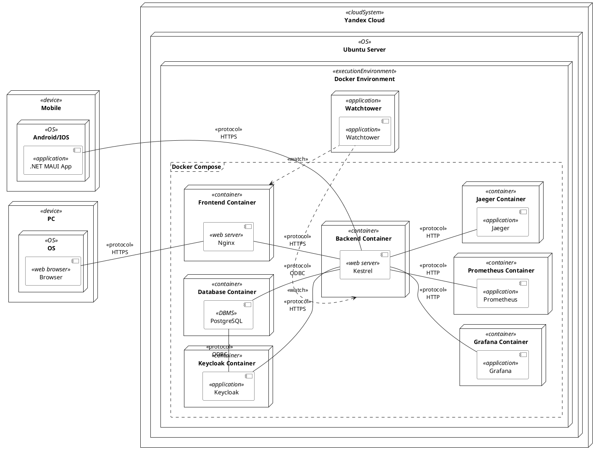
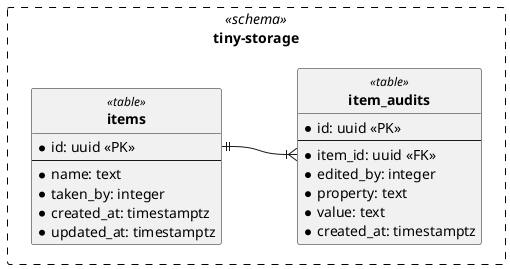

# Команда 2.5.

## Команда

- Гнипель Анна Владимировна: FullStack
- Папикян Сергей Седракович: TL + Mobile + Backend + SRE
- Пилипченко Степан Кириллович: Design + PM
- ~~Кривошеев Святослав Сергеевич~~

### Пространство и ТЗ

- [Notion](https://rhinestone-suede-4a3.notion.site/52f1207faddb4304b43b8391159b4692?v=1a5a2d62c7aa80ada4e5000c15cfb700&pvs=73)
- [ТЗ](../assets/TZ.pdf)

## Демо

- [Сайт](https://tiny-storage.online/app)
- [APK](https://github.com/TinyStorage/TinyStorage-Mobile/releases/tag/0.0.1)

### Репозитории

| Название                                                           | Описание                                                                 |
|--------------------------------------------------------------------|--------------------------------------------------------------------------|
| [📦 Backend](https://github.com/TinyStorage/TityStorage-Backend)   | ASP.NET API с OAuth2 авторизацией, хранением данных и логикой учёта      |
| [📱 Mobile](https://github.com/TinyStorage/TinyStorage-Mobile)     | Приложение на .NET MAUI для сканирования предметов и выполнения операций |
| [💻 Frontend](https://github.com/TinyStorage/TinyStorage-Frontend) | Веб-интерфейс для просмотра предметов и аудита                           |

### Видео

- [AdminMobile.mp4](https://drive.google.com/file/d/1TbBI2STGWXrby-NsTOqpUq5Wee71caVB/view?usp=drive_link)
- [AdminWeb.mp4](https://drive.google.com/file/d/1NB2W1eqKGuM1Twww17rSqR_mqLmzG_XZ/view?usp=drive_link)
- [LabworkerMobile.mp4](https://drive.google.com/file/d/1p9qCIypdbvjy0vCt6qmQa4NhOV_bSMaN/view?usp=drive_link)
- [LabworkerWeb.mp4](https://drive.google.com/file/d/1_ax6NxdgXN4CRUMWaxaIHAiZIIxToPpj/view?usp=drive_link)

## Учетные записи

| Логин           | Пароль          | Роли     |
|-----------------|-----------------|----------|
| itmo_labworker1 | itmo_labworker1 | Лаборант |
| itmo_labworker2 | itmo_labworker2 | Лаборант |
| itmo_admin      | itmo_admin      | Админ    |

## Тестовые данные

|  |  |  |
|-------------------------------------------------------------------------------------------------------------------------------------|-------------------------------------------------------------------------------------------------------------------------------------|-------------------------------------------------------------------------------------------------------------------------------------|
| Не зарегестрированный                                                                                                               | Не зарегестрированный                                                                                                               | Зарегестированный                                                                                                                   |

## Тех. артефакты

### Системная архитектура

### ERD

